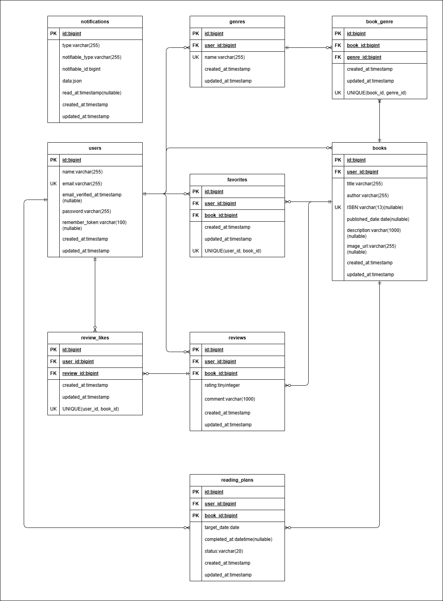

# BookShelf 書籍レビューアプリ

書籍レビューの機能を実装したLaravelプロジェクトです。
ユーザーは書籍を登録・閲覧し、レビューの投稿やお気に入り登録、読書計画の管理ができます。
ジャンルによる分類やレビューへのいいね機能、平均評価に基づくランキング機能、自身の読書統計機能も備えています。

## 機能一覧

- ユーザー認証（登録、ログイン、ログアウト）
- 書籍管理（書籍一覧表示・書籍詳細表示・書籍登録・書籍編集・書籍削除）
- 書籍検索（キーワード検索、ジャンルフィルタ、並び順ソート）
- 書籍ISBN検索（Google Books API連携した書籍情報自動取得）
- お気に入り（お気に入り書籍一覧表示、お気に入り登録・お気に入り解除）
- レビュー（レビュー登録・レビュー編集・レビュー削除）
- レビューへのいいね（いいね登録・いいね解除）
- ジャンル管理（ジャンル一覧表示・ジャンル詳細表示・ジャンル登録・ジャンル編集・ジャンル削除）
- 読書計画登録機能（読書計画一覧表示・読書計画登録・読書計画編集・読書計画削除）
- ランキング（書籍のレビュー平均評価に基づくTOP10）一覧表示
- マイ読書レポート（ユーザー毎のレビュー評価値などを統計化）
- 通知機能（通知一覧表示、既読機能、バッチスケジュール：毎日20時）
- 公開API（Laravel Sanctumによる認証、書籍CRUD）

## 使用技術

- PHP 8.5
- Laravel 10.x
- MySQL 8.4
- Nginx
- Docker / Docker Compose / Laravel Sail
- Vite / Tailwind CSS 3.4
- Laravel Fortify（認証）
- phpMyAdmin

## ER図



## 開発環境URL

http://localhost

## 動作環境

- Docker
- Docker Compose

※ Windowsの場合はWSL2の利用を推奨します。

## 環境構築手順

1. **リポジトリをクローン**

    ```bash
    git clone https://github.com/tasuku1209/bookshelf-app.git
    ```

2. **.envファイルの準備**

    `.env.example` をコピーして `.env` を作成します。

    ```bash
    cp .env.example .env
    ```

    `.env` ファイル内の以下のDB接続情報を確認・設定します。`.env.example` のデフォルト値はSail向けではないため、以下のように変更してください。

    ```ini
    DB_CONNECTION=mysql
    DB_HOST=mysql
    DB_PORT=3306
    DB_DATABASE=laravel
    DB_USERNAME=sail
    DB_PASSWORD=password
    ```

3. **Composer依存パッケージのインストール**

    プロジェクトの初回セットアップ時は、`vendor` ディレクトリが存在しないため `sail` コマンドを使用できません。
    以下のDockerコマンドを実行して、コンテナ内で `composer install` を実行します。

    ```bash
    docker run --rm \
        -u "$(id -u):$(id -g)" \
        -v "$(pwd):/var/www/html" \
        -w /var/www/html \
        laravelsail/php82-composer:latest \
        composer install --ignore-platform-reqs
    ```

4. **Laravel Sailの起動**

    以下のコマンドでDockerコンテナを起動します。

    ```bash
    ./vendor/bin/sail up -d
    ```

    > **エイリアスの設定（推奨）**
    >
    > 毎回 `./vendor/bin/sail` と入力するのは手間なので、エイリアスを設定すると便利です。
    >
    > ```bash
    > alias sail='[ -f sail ] && bash sail || bash vendor/bin/sail'
    > ```

5. **アプリケーションキーの生成**

    ```bash
    sail artisan key:generate
    ```

6. **データベースのマイグレーションと初期データ投入**

    以下のコマンドでテーブルを作成し、ダミーデータを投入します。

    ```bash
    sail artisan migrate:fresh --seed
    ```
    このコマンドの入力後、下記のエラーが表示されることがあります。
    ```bash
       Illuminate\Database\QueryException 
      SQLSTATE[HY000] [1044] Access denied for user 'sail'@'%' to database 'laravel' (Connection: mysql, SQL: select table_name as `name`,         (data_length + index_length) as `size`, table_comment as `comment`, engine as `engine`, table_collation as `collation` from information_schema.tables where table_schema = 'laravel' and table_type in ('BASE TABLE', 'SYSTEM VERSIONED') order by table_name)

      at vendor/laravel/framework/src/Illuminate/Database/Connection.php:829
        825▕                     $this->getName(), $query, $this->prepareBindings($bindings), $e
        826▕                 );
        827▕             }
        828▕ 
      ➜ 829▕             throw new QueryException(
        830▕                 $this->getName(), $query, $this->prepareBindings($bindings), $e
        831▕             );
        832▕         }
        833▕     }

      +43 vendor frames 

      44  artisan:35
          Illuminate\Foundation\Console\Kernel::handle()
    ```
    このエラーはコンテナ内にデータが残っており、エラーが生じているケースなどがあります。
    その場合は、以下のコマンドを順に実行して各コンテナを再起動して下さい。
    ```Bash
    sail down -v
    sail up -d　//コマンド実行後にSQLコンテナが立ち上がるまで時間がかかります。30秒ほどお待ちください。
    sail artisan migrate:fresh --seed
    ```
    

7. **フロントエンドのビルド**

    ```bash
    sail npm install
    sail npm install alpinejs
    sail npm run dev
    ```

    `npm run dev` は開発中は起動したままにしてください。

8. **アプリケーションへのアクセス**

    ブラウザで [http://localhost](http://localhost) にアクセスします。

9. **外部APIの設定**

    ISBN検索機能ではGoogle Books APIを使用しています。
    本アプリを動作させるには、Google Books APIのAPIキーを取得し、
    `.env` に以下を設定してください。
    ```bash
    GOOGLE_BOOKS_API_KEY=取得したAPIキー
    ```


## テスト実行

```bash
sail artisan test
```

カバレッジ付きで実行する場合:

```bash
sail artisan test --coverage
```

## APIエンドポイント一覧

全エンドポイントは `/api/v1` プレフィックス配下に定義されています。
認証が必要なエンドポイントは、ログアウト、書籍登録、書籍更新、書籍削除です。
書籍更新・削除には、認証に加え、Policyによる所有者チェックを設定しています。

| HTTPメソッド | URI | 概要 |
|---|---|---|
| POST | /api/v1/login | ログイン |
| POST | /api/v1/logout | ログアウト |
| GET | /api/v1/books |書籍一覧（検索・ジャンルソート・ページネーション付き） |
| GET | /api/v1/books/{book} | 書籍詳細（ジャンル情報・レビュー情報含む） |
| POST | /api/v1/books | 書籍登録 |
| PUT | /api/v1/books/{book} | 書籍更新 |
| DELETE | /api/v1/books/{book} | 書籍削除 |

## 作成者

高津　丞（たかつ　たすく）
